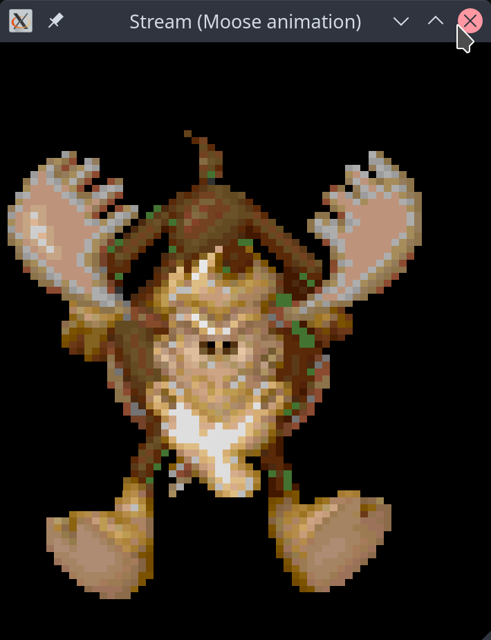
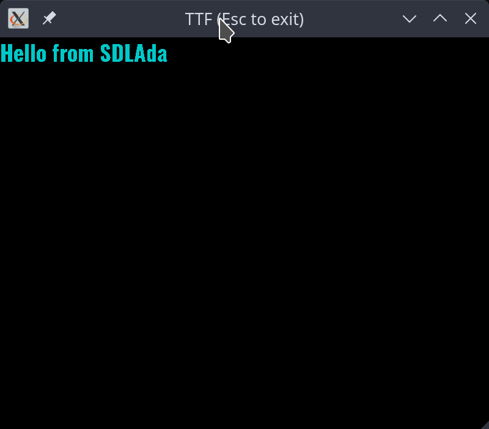
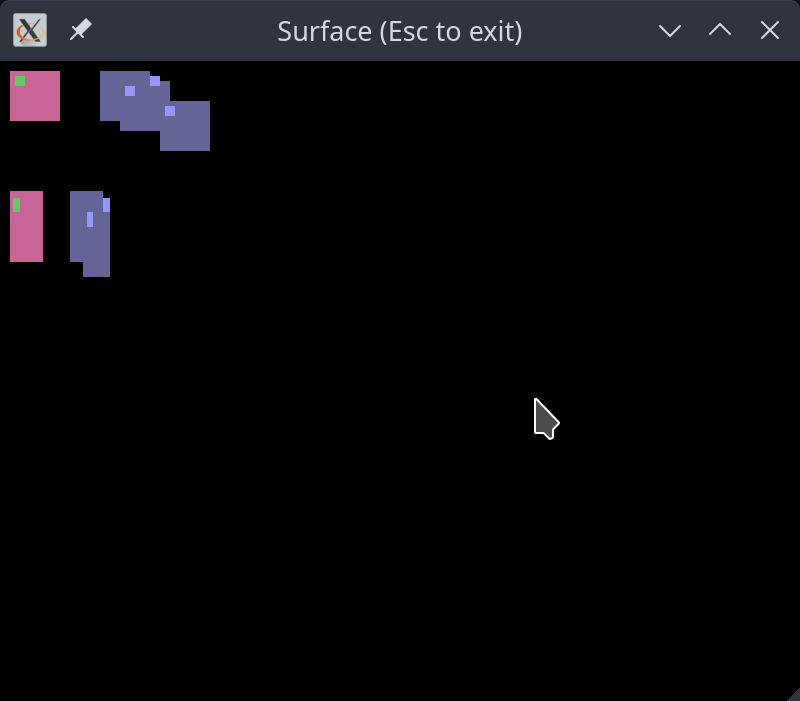

 # SDLAda

This is a new variable thickness Ada 2012 binding to SDL 2.x.y (http://www.libsdl.org). This means that things are
wrapped when they need to be into a thicker binding and those things that can just be imported, are.

There will still be a need to use conditional compilation for the various platforms as there will be
some platform specifics which cannot be abstracted out cleanly, but this will be reduced as much as possible.

The bindings are only generated for the specific parts of SDL which Ada does not already have support for, i.e.
threads are not bound as Ada has tasking support built in.

## Usage, Licence & Attribution

SDLAda is distributed under the same zlib licence as the SDL library is. You may use this library in any way
you like whether free or commercial. I would add that whilst you don't have to state that your game uses this
library, it would be nice if you did, it's all good advertising for Ada :)

You do not need to complete any copyright assignment forms, the licence will not change from zlib as I want people to be
able to use the library however they wish without restrictions.

## Building

### Makefile

This was originally built with the idea that there could be different compilers and their build scripts would go into a ```build/<compiler>``` directory. This can still be built with the makefile, the subsequent extracted components cannot.

There are a number of variables which can be set to control the compilation:

* SDL_PLATFORM = Can be set to one of the following values: linux, windows, macosx, macos_homebrew, ios or android
* SDL_MODE     = Can be one of: debug or release. Defaults to debug.

```
cd build/gnat
make SDL_PLATFORM=linux SDL_MODE=release
```

### Alire

You can build the library with Alire now, by calling the following in the root directory:

```
alr build
```

This seems to have come up as an issue, people not checking the original makefile on [lines 29 and 93](./build/gnat/makefile) on how to link SDLAda. SDL2 comes with the ```sdl2-config``` command which includes the following options:

```bash
$ sdl2-config --help
Usage: /usr/bin/sdl2-config [--prefix[=DIR]] [--exec-prefix[=DIR]] [--version] [--cflags] [--libs]

$ sdl2-config --cflags
-I/usr/include/SDL2 -D_REENTRANT

$ sdl2-config --libs
-L/usr/lib64 -lSDL2
```

These options will differ depending on operating system. SDL3 seems like it might operate in a bit more of a portable way.

#### Linking

To link an application with sdlada, you will need to add ```-largs $(sdl2-config --libs)``` to command line:

```bash
$ cd <game|app dir>
$ alr build -- -largs $(sdl2-config --libs)
```

You'll also need to add ```-lSDL2_image```, ```-lSDL2_ttf``` and ```-lSDL2_mixer``` for your platform. TODO: Fix this.

This will only be required for the time being.

#### MacOS

SDLAda's alire.toml is set up to use the Homebrew and MacPorts distributions, so you need to install the dependencies first.

##### Home Brew

```
brew install sdl2
brew install sdl2_ttf
brew install sdl2_image
brew install sdl2_mixer
```

##### Mac Ports

```
sudo port install libsdl2
sudo port install libsdl2_ttf
sudo port install libsdl2_image
sudo port install libsdl2_mixer
```

## Installation

```
make SDL_PLATFORM=linux SDL_MODE=release DESTDIR=$HOME/opt/sdlada install
```

## Examples

You can find more examples hosted on [Rosetta Code](http://www.rosettacode.org/wiki/Category:SDLAda).

## Screenshots





## Copyright notice

See [LICENCE](./LICENCE) file.

## Thanks to

To everyone who has provided patches, pull requests, typo fixes, etc.

## WARNING!!!

I have tried to model the types correctly, but remember SDL is a C library and some things may not make sense. Please
file a bug report if you use this library and find that a type does not cover enough values for cross-platform use.

## TODO

Anything listed here is a question of whether it's required.

* Do we need to hook into the Assert module? To raise an exception maybe?
* Create event tagged type hierarchy, use Poll to convert the C events into these types.
* Task safe event handling?
* Split Image, TTF into separate GPR files.
* Cross platform testing.
* Optimisations to make the library as thin as possible:
  - Enable -gnatN for inlining.
  - Try to get as much pre-elaborated as possible.
* Disable a shared library build, make it a static only build, this makes it easier to distribute. i.e. Link with this
  library and distribute SDL2 libs only.
* Hide the RWops stuff maybe? Should really be using Ada streams and files.

## [Current version](http://www.semver.org)

See [alire.toml](./alire.toml)

## Versions tested against

Library   | Version
----------|--------
SDL       | 2.28.5
SDL_image | 2.6.3
SDL_mixer | 2.6.3
SDL_ttf   | 2.20.2

## Status

### SDL Core

#### Init / Shutdown

Name                                  | Bound | Since  | Won't bind
--------------------------------------|-------|--------|-----------
SDL_Init                              |   y   |        |
SDL_InitSubSystem                     |   y   |        |
SDL_Quit                              |   y   |        |
SDL_QuitRequested                     |   n   |        |
SDL_QuitSubSystem                     |   y   |        |
SDL_SetMainReady                      |   n   |        |
SDL_WasInit                           |   y   |        |
SDL_WinRTRunApp                       |   n   |        |

#### Configuration Variables

Name                                  | Bound | Since  | Won't bind
--------------------------------------|-------|--------|-----------
SDL_AddHintCallback                   |   n   |        |
SDL_ClearHints                        |   y   |        |
SDL_DelHintCallback                   |   n   |        |
SDL_GetHint                           |   y   |        |
SDL_GetHintBoolean                    |   n   |        |
SDL_ResetHint                         |   n   | 2.24.0 |
SDL_ResetHints                        |   n   | 2.26.0 |
SDL_SetHint                           |   y   |        |
SDL_SetHintWithPriority               |   y   |        |

#### Error Handling

Name                                  | Bound | Since  | Won't bind
--------------------------------------|-------|--------|-----------
SDL_ClearError                        |   y   |        |
SDL_GetError                          |   y   |        |
SDL_GetErrorMsg                       |   y   |        |
SDL_SetError                          |   y   |        |

#### Log Handling

Name                                  | Bound | Since  | Won't bind
--------------------------------------|-------|--------|-----------
SDL_Log                               |   y   |        |
SDL_LogCritical                       |   y   |        |
SDL_LogDebug                          |   y   |        |
SDL_LogError                          |   y   |        |
SDL_LogGetOutputFunction              |   n   |        |
SDL_LogGetPriority                    |   n   |        |
SDL_LogInfo                           |   y   |        |
SDL_LogMessage                        |   y   |        |
SDL_LogMessageV                       |   n   |        |
SDL_LogResetPriorities                |   y   |        |
SDL_LogSetAllPriority                 |   y   |        |
SDL_LogSetOutputFunction              |   n   |        |
SDL_LogSetPriority                    |   y   |        |
SDL_LogVerbose                        |   y   |        |
SDL_LogWarn                           |   y   |        |

#### Assertions

Name                                  | Bound | Since  | Won't bind
--------------------------------------|-------|--------|-----------
SDL_assert                            |   n   |        |
SDL_assert_paranoid                   |   n   |        |
SDL_assert_release                    |   n   |        |
SDL_GetAssertionHandler               |   n   |        |
SDL_GetAssertionReport                |   n   |        |
SDL_GetDefaultAssertionHandler        |   n   |        |
SDL_ResetAssertionReport              |   n   |        |
SDL_SetAssertionHandler               |   n   |        |
SDL_TriggerBreakpoint                 |   n   |        |

#### Querying SDL Version

Name                                  | Bound | Since  | Won't bind
--------------------------------------|-------|--------|-----------
SDL_COMPILEDVERSION                   |   n   |        |      *
SDL_GetRevision                       |   y   |        |
SDL_GetRevisionNumber                 |   y   |        |
SDL_GetVersion                        |   y   |        |
SDL_REVISION                          |   n   |        |      *
SDL_VERSION                           |   n   |        |      *
SDL_VERSIONNUM                        |   n   |        |      *
SDL_VERSION_ATLEAST                   |   n   |        |      *

#### Display and Window Management

Name                                  | Bound | Since  | Won't bind
--------------------------------------|-------|--------|-----------
SDL_CreateWindow                      |   y   |        |
SDL_CreateWindowFrom                  |   y   |        |
SDL_DestroyWindow                     |   y   |        |
SDL_DestroyWindowSurface              |   n   | 2.28.0 |
SDL_DisableScreenSaver                |   y   |        |
SDL_EnableScreenSaver                 |   y   |        |
SDL_FlashWindow                       |   n   | 2.0.16 |
SDL_GetClosestDisplayMode             |   y   |        |
SDL_GetCurrentDisplayMode             |   y   |        |
SDL_GetCurrentVideoDriver             |   y   |        |
SDL_GetDesktopDisplayMode             |   y   |        |
SDL_GetDisplayBounds                  |   y   |        |
SDL_GetDisplayDPI                     |   n   | 2.0.4  |
SDL_GetDisplayMode                    |   y   |        |
SDL_GetDisplayName                    |   n   |        |
SDL_GetDisplayOrientation             |   n   | 2.0.9  |
SDL_GetDisplayUsableBounds            |   n   | 2.0.5  |
SDL_GetGrabbedWindow                  |   n   | 2.0.4  |
SDL_GetNumDisplayModes                |   y   |        |
SDL_GetNumVideoDisplays               |   y   |        |
SDL_GetNumVideoDrivers                |   y   |        |
SDL_GetPointDisplayIndex              |   n   | 2.24.0 |
SDL_GetRectDisplayIndex               |   n   | 2.24.0 |
SDL_GetVideoDriver                    |   y   |        |
SDL_GetWindowBordersSize              |   n   | 2.0.5  |
SDL_GetWindowBrightness               |   y   |        |
SDL_GetWindowData                     |   y   |        |
SDL_GetWindowDisplayIndex             |   y   |        |
SDL_GetWindowDisplayMode              |   y   |        |
SDL_GetWindowFlags                    |   y   |        |
SDL_GetWindowFromID                   |   y   |        |
SDL_GetWindowGammaRamp                |   y   |        |
SDL_GetWindowGrab                     |   y   |        |
SDL_GetWindowICCProfile               |   n   | 2.0.18 |
SDL_GetWindowID                       |   y   |        |
SDL_GetWindowKeyboardGrab             |   n   | 2.0.16 |
SDL_GetWindowMaximumSize              |   y   |        |
SDL_GetWindowMinimumSize              |   y   |        |
SDL_GetWindowMouseGrab                |   n   | 2.0.16 |
SDL_GetWindowMouseRect                |   n   | 2.0.18 |
SDL_GetWindowOpacity                  |   n   | 2.0.5  |
SDL_GetWindowPixelFormat              |   y   |        |
SDL_GetWindowPosition                 |   y   |        |
SDL_GetWindowSize                     |   y   |        |
SDL_GetWindowSizeInPixels             |   n   | 2.26.0 |
SDL_GetWindowSurface                  |   y   |        |
SDL_GetWindowTitle                    |   y   |        |
SDL_GL_CreateContext                  |   y   |        |
SDL_GL_DeleteContext                  |   y   |        |
SDL_GL_ExtensionSupported             |   y   |        |
SDL_GL_GetAttribute                   |   y   |        |
SDL_GL_GetCurrentContext              |   y   |        |
SDL_GL_GetCurrentWindow               |   n   |        |
SDL_GL_GetDrawableSize                |   y   |        |
SDL_GL_GetProcAddress                 |   y   |        |
SDL_GL_GetSwapInterval                |   y   |        |
SDL_GL_LoadLibrary                    |   y   |        |
SDL_GL_MakeCurrent                    |   y   |        |
SDL_GL_ResetAttributes                |   y   |        |
SDL_GL_SetAttribute                   |   y   |        |
SDL_GL_SetSwapInterval                |   y   |        |
SDL_GL_SwapWindow                     |   y   |        |
SDL_GL_UnloadLibrary                  |   y   |        |
SDL_HasWindowSurface                  |   n   | 2.28.0 |
SDL_HideWindow                        |   y   |        |
SDL_IsScreenSaverEnabled              |   y   |        |
SDL_MaximizeWindow                    |   y   |        |
SDL_MinimizeWindow                    |   y   |        |
SDL_RaiseWindow                       |   y   |        |
SDL_RestoreWindow                     |   y   |        |
SDL_SetWindowAlwaysOnTop              |   n   | 2.0.16 |
SDL_SetWindowBordered                 |   n   |        |
SDL_SetWindowBrightness               |   y   |        |
SDL_SetWindowData                     |   y   |        |
SDL_SetWindowDisplayMode              |   y   |        |
SDL_SetWindowFullscreen               |   y   |        |
SDL_SetWindowGammaRamp                |   y   |        |
SDL_SetWindowGrab                     |   y   |        |
SDL_SetWindowHitTest                  |   n   |        |
SDL_SetWindowIcon                     |   y   |        |
SDL_SetWindowInputFocus               |   n   | 2.0.5  |
SDL_SetWindowKeyboardGrab             |   n   | 2.0.16 |
SDL_SetWindowMaximumSize              |   y   |        |
SDL_SetWindowMinimumSize              |   y   |        |
SDL_SetWindowModalFor                 |   n   | 2.0.5  |
SDL_SetWindowMouseGrab                |   n   | 2.0.16 |
SDL_SetWindowMouseRect                |   n   | 2.0.18 |
SDL_SetWindowOpacity                  |   n   | 2.0.5  |
SDL_SetWindowPosition                 |   y   |        |
SDL_SetWindowResizable                |   n   | 2.0.5  |
SDL_SetWindowSize                     |   y   |        |
SDL_SetWindowTitle                    |   y   |        |
SDL_ShowWindow                        |   y   |        |
SDL_UpdateWindowSurface               |   n   |        |
SDL_UpdateWindowSurfaceRects          |   y   |        |
SDL_VideoInit                         |   y   |        |
SDL_VideoQuit                         |   y   |        |

#### 2D Accelerated Rendering

Name                                  | Bound | Since  | Won't bind
--------------------------------------|-------|--------|-----------
SDL_CreateRenderer                    |   y   |        |
SDL_CreateSoftwareRenderer            |   y   |        |
SDL_CreateTexture                     |   y   |        |
SDL_CreateTextureFromSurface          |   y   |        |
SDL_CreateWindowAndRenderer           |   n   |        |
SDL_DestroyRenderer                   |   y   |        |
SDL_DestroyTexture                    |   y   |        |
SDL_GetNumRenderDrivers               |   y   |        |
SDL_GetRenderDrawBlendMode            |   y   |        |
SDL_GetRenderDrawColor                |   y   |        |
SDL_GetRenderDriverInfo               |   n   |        |
SDL_GetRenderer                       |   y   |        |
SDL_GetRendererInfo                   |   n   |        |
SDL_GetRendererOutputSize             |   n   |        |
SDL_GetRenderTarget                   |   n   |        |
SDL_GetTextureAlphaMod                |   y   |        |
SDL_GetTextureBlendMode               |   y   |        |
SDL_GetTextureColorMod                |   y   |        |
SDL_GetTextureScaleMode               |   n   | 2.0.12 |
SDL_GetTextureUserData                |   n   | 2.0.18 |
SDL_GL_BindTexture                    |   y   |        |
SDL_GL_UnbindTexture                  |   y   |        |
SDL_LockTexture                       |   y   |        |
SDL_LockTextureToSurface              |   n   | 2.0.12 |
SDL_QueryTexture                      |   y   |        |
SDL_RenderClear                       |   y   |        |
SDL_RenderCopy                        |   y   |        |
SDL_RenderCopyEx                      |   y   |        |
SDL_RenderCopyExF                     |   n   | 2.0.10 |
SDL_RenderCopyF                       |   n   | 2.0.10 |
SDL_RenderDrawLine                    |   y   |        |
SDL_RenderDrawLineF                   |   n   | 2.0.10 |
SDL_RenderDrawLines                   |   y   |        |
SDL_RenderDrawLinesF                  |   n   | 2.0.10 |
SDL_RenderDrawPoint                   |   y   |        |
SDL_RenderDrawPointF                  |   n   | 2.0.10 |
SDL_RenderDrawPoints                  |   y   |        |
SDL_RenderDrawPointsF                 |   n   | 2.0.10 |
SDL_RenderDrawRect                    |   y   |        |
SDL_RenderDrawRectF                   |   n   | 2.0.10 |
SDL_RenderDrawRects                   |   y   |        |
SDL_RenderDrawRectsF                  |   n   | 2.0.10 |
SDL_RenderFillRect                    |   y   |        |
SDL_RenderFillRectF                   |   n   | 2.0.10 |
SDL_RenderFillRects                   |   y   |        |
SDL_RenderFillRectsF                  |   n   | 2.0.10 |
SDL_RenderFlush                       |   n   | 2.0.10 |
SDL_RenderGeometry                    |   n   | 2.0.18 |
SDL_RenderGeometryRAW                 |   n   | 2.0.18 |
SDL_RenderGetClipRect                 |   y   |        |
SDL_RenderGetIntegerScale             |   n   | 2.0.5  |
SDL_RenderGetLogicalSize              |   y   |        |
SDL_RenderGetMetalCommandEncoder      |   n   | 2.0.8  |
SDL_RenderGetMetalLayer               |   n   | 2.0.8  |
SDL_RenderGetScale                    |   y   |        |
SDL_RenderGetViewport                 |   y   |        |
SDL_RenderGetWindow                   |   y   | 2.0.22 |
SDL_RenderIsClipEnabled               |   n   |        |
SDL_RenderLogicalToWindow             |   n   | 2.0.18 |
SDL_RenderPresent                     |   y   |        |
SDL_RenderReadPixels                  |   n   |        |
SDL_RenderSetClipRect                 |   y   |        |
SDL_RenderSetIntegerScale             |   n   | 2.0.5  |
SDL_RenderSetLogicalSize              |   y   |        |
SDL_RenderSetScale                    |   y   |        |
SDL_RenderSetViewport                 |   y   |        |
SDL_RenderSetVSync                    |   n   | 2.0.18 |
SDL_RenderTargetSupported             |   y   |        |
SDL_RenderWindowToLogical             |   n   | 2.0.18 |
SDL_SetRenderDrawBlendMode            |   y   |        |
SDL_SetRenderDrawColor                |   y   |        |
SDL_SetRenderTarget                   |   y   |        |
SDL_SetTextureAlphaMod                |   y   |        |
SDL_SetTextureBlendMode               |   y   |        |
SDL_SetTextureColorMod                |   y   |        |
SDL_SetTextureScaleMode               |   n   | 2.0.12 |
SDL_SetTextureUserData                |   n   | 2.0.18 |
SDL_UnlockTexture                     |   y   |        |
SDL_UpdateNVTexture                   |   n   | 2.0.16 |
SDL_UpdateTexture                     |   n   | 2.0.0  |
SDL_UpdateYUVTexture                  |   n   | 2.0.1  |

#### Pixel Formats and Conversion Routines

Name                                  | Bound | Since  | Won't bind
--------------------------------------|-------|--------|-----------
SDL_AllocFormat                       |   y   |        |
SDL_AllocPalette                      |   y   |        |
SDL_CalculateGammaRamp                |   y   |        |
SDL_FreeFormat                        |   y   |        |
SDL_FreePalette                       |   y   |        |
SDL_GetPixelFormatName                |   y   |        |
SDL_GetRGB                            |   y   |        |
SDL_GetRGBA                           |   y   |        |
SDL_MapRGB                            |   y   |        |
SDL_MapRGBA                           |   y   |        |
SDL_MasksToPixelFormatEnum            |   y   |        |
SDL_PixelFormatEnumToMasks            |   y   |        |
SDL_SetPaletteColors                  |   n   |        |
SDL_SetPixelFormatPalette             |   n   |        |

#### Rectangle Functions

Name                                  | Bound | Since  | Won't bind
--------------------------------------|-------|--------|-----------
SDL_EncloseFPoints                    |   n   | 2.0.22 |
SDL_EnclosePoints                     |   y   |        |
SDL_FRectEmpty                        |   n   | ?      |
SDL_FRectEquals                       |   n   | 2.0.22 |
SDL_FRectEqualsEpsilon                |   n   | 2.0.22 |
SDL_HasIntersection                   |   y   |        |
SDL_HasIntersectionF                  |   n   | 2.0.22 |
SDL_IntersectFRect                    |   n   | 2.0.22 |
SDL_IntersectFRectAndLine             |   n   | 2.0.22 |
SDL_IntersectRect                     |   y   |        |
SDL_IntersectRectAndLine              |   y   |        |
SDL_PointInFRect                      |   n   | ?      |
SDL_PointInRect                       |   n   | ?      |
SDL_RectEmpty                         |   n   | ?      |
SDL_RectEquals                        |   n   | ?      |
SDL_UnionFRect                        |   n   | 2.0.22 |
SDL_UnionRect                         |   n   |        |

#### Surface Creation and Simple Drawing

Name                                  | Bound | Since  | Won't bind
--------------------------------------|-------|--------|-----------
SDL_BlitScaled                        |   y   |        |
SDL_BlitSurface                       |   y   |        |
SDL_ConvertPixels                     |   n   | 2.0.0  |
SDL_ConvertSurface                    |   n   | 2.0.0  |
SDL_ConvertSurfaceFormat              |   n   | 2.0.0  |
SDL_CreateRGBSurface                  |   y   | 2.0.0  |
SDL_CreateRGBSurfaceFrom              |   n   | 2.0.0  |
SDL_CreateRGBSurfaceWithFormat        |   n   | 2.0.5  |
SDL_CreateRGBSurfaceWithFormatFrom    |   n   | 2.0.5  |
SDL_FillRect                          |   y   |        |
SDL_FillRects                         |   y   |        |
SDL_FreeSurface                       |   y   |        |
SDL_GetClipRect                       |   y   |        |
SDL_GetColorKey                       |   y   |        |
SDL_GetSurfaceAlphaMod                |   y   |        |
SDL_GetSurfaceBlendMode               |   y   |        |
SDL_GetSurfaceColorMod                |   y   |        |
SDL_GetYUVConversionMode              |   n   | 2.0.8  |
SDL_GetYUVConversionModeForResolution |   n   | 2.0.8  |
SDL_HasColorKey                       |   n   | 2.0.9  |
SDL_HasSurfaceRLE                     |   n   | 2.0.14 |
SDL_LoadBMP                           |   n   |        |
SDL_LoadBMP_RW                        |   n   |        |
SDL_LockSurface                       |   y   |        |
SDL_LowerBlit                         |   y   |        |
SDL_LowerBlitScaled                   |   y   |        |
SDL_MUSTLOCK                          |   y   |        | TODO: Function expression.
SDL_PremultiplyAlpha                  |   n   | 2.0.18 |
SDL_SaveBMP                           |   n   |        |
SDL_SaveBMP_RW                        |   n   |        |
SDL_SetClipRect                       |   y   |        |
SDL_SetColorKey                       |   y   |        |
SDL_SetSurfaceAlphaMod                |   y   |        |
SDL_SetSurfaceBlendMode               |   y   |        |
SDL_SetSurfaceColorMod                |   y   |        |
SDL_SetSurfacePalette                 |   n   |        |
SDL_SetSurfaceRLE                     |   y   |        |
SDL_SetYUVConversionMode              |   n   | 2.0.8  |
SDL_SoftStretch                       |   n   | 2.0.0  |
SDL_SoftStretchLinear                 |   n   | 2.0.16 |
SDL_UnlockSurface                     |   y   |        |
SDL_UpperBlit                         |   n   | 2.0.0  |
SDL_UpperBlitScaled                   |   n   | 2.0.0  |

#### Platform-specific Window Management

Name                                  | Bound | Since  | Won't bind
--------------------------------------|-------|--------|-----------
SDL_GetWindowWMInfo                   |   y   |        |

#### Clipboard Handling

Name                                  | Bound | Since  | Won't bind
--------------------------------------|-------|--------|-----------
SDL_GetClipboardText                  |   y   |        |
SDL_GetPrimarySelectionText           |   n   | 2.26.0 |
SDL_HasClipboardText                  |   y   |        |
SDL_HasPrimarySelectionText           |   n   | 2.26.0 |
SDL_SetClipboardText                  |   y   |        |
SDL_SetPrimarySelectionText           |   n   | 2.26.0 |

#### Vulkan Support

Name                                  | Bound | Since  | Won't bind
--------------------------------------|-------|--------|-----------
SDL_Vulkan_CreateSurface              |   n   | 2.0.6  |
SDL_Vulkan_GetDrawableSize            |   n   | 2.0.6  |
SDL_Vulkan_GetInstanceExtensions      |   n   | 2.0.6  |
SDL_Vulkan_GetInstanceExtensions      |   n   | 2.0.6  |
SDL_Vulkan_LoadLibrary                |   n   | 2.0.6  |
SDL_Vulkan_UnloadLibrary              |   n   | 2.0.6  |

#### Metal Support

Name                                  | Bound | Since  | Won't bind
--------------------------------------|-------|--------|-----------
SDL_Metal_CreateView                  |   n   | 2.0.12 |
SDL_Metal_DestroyView                 |   n   | 2.0.12 |
SDL_Metal_GetDrawableSize             |   n   | 2.0.14 |
SDL_Metal_GetLayer                    |   n   | 2.0.14 |

#### Event Handling

Name                                  | Bound | Since  | Won't bind
--------------------------------------|-------|--------|-----------
SDL_AddEventWatch                     |   n   |        |
SDL_DelEventWatch                     |   n   |        |
SDL_EventState                        |   n   |        |
SDL_FilterEvents                      |   n   |        |
SDL_FlushEvent                        |   n   |        |
SDL_FlushEvents                       |   n   |        |
SDL_GetEventFilter                    |   n   |        |
SDL_HasEvent                          |   n   |        |
SDL_HasEvents                         |   n   |        |
SDL_PeepEvents                        |   n   |        |
SDL_PollEvent                         |   y   |        |
SDL_PumpEvents                        |   n   |        |
SDL_PushEvent                         |   n   |        |
SDL_RegisterEvents                    |   n   |        |
SDL_SetEventFilter                    |   n   |        |
SDL_WaitEvent                         |   n   |        |
SDL_WaitEventTimeout                  |   n   |        |

#### Keyboard Support

Name                                  | Bound | Since  | Won't bind
--------------------------------------|-------|--------|-----------
SDL_ClearComposition                  |   y   | 2.0.22 |
SDL_GetKeyboardFocus                  |   y   |        |
SDL_GetKeyboardState                  |   y   |        |
SDL_GetKeyFromName                    |   y   |        |
SDL_GetKeyFromScancode                |   y   |        |
SDL_GetKeyName                        |   y   |        |
SDL_GetModState                       |   y   |        |
SDL_GetScancodeFromKey                |   y   |        |
SDL_GetScancodeFromName               |   y   |        |
SDL_GetScancodeName                   |   y   |        |
SDL_HasScreenKeyboardSupport          |   y   |        |
SDL_IsScreenKeyboardShown             |   y   |        |
SDL_IsTextInputActive                 |   y   |        |
SDL_IsTextInputShown                  |   y   | 2.0.22 |
SDL_ResetKeyboard                     |   y   | 2.24.0 |
SDL_SetModState                       |   y   |        |
SDL_SetTextInputRect                  |   y   |        |
SDL_StartTextInput                    |   y   |        |
SDL_StopTextInput                     |   y   |        |

#### Mouse Support

Name                                  | Bound | Since  | Won't bind
--------------------------------------|-------|--------|-----------
SDL_CaptureMouse                      |   y   |        |
SDL_CreateColorCursor                 |   n   |        |
SDL_CreateCursor                      |   n   |        |
SDL_CreateSystemCursor                |   y   |        |
SDL_FreeCursor                        |   y   |        |
SDL_GetCursor                         |   y   |        |
SDL_GetDefaultCursor                  |   n   |        |
SDL_GetGlobalMouseState               |   y   |        |
SDL_GetMouseFocus                     |   n   |        |
SDL_GetMouseState                     |   y   |        |
SDL_GetRelativeMouseMode              |   y   |        |
SDL_GetRelativeMouseState             |   y   |        |
SDL_SetCursor                         |   y   |        |
SDL_SetRelativeMouseMode              |   y   |        |
SDL_ShowCursor                        |   n   |        |
SDL_WarpMouseGlobal                   |   y   |        |
SDL_WarpMouseInWindow                 |   y   |        |

#### Joystick Support

Name                                  | Bound | Since  | Won't bind
--------------------------------------|-------|--------|-----------
SDL_GetJoystickGUIDInfo               |   n   | 2.26.0 |
SDL_JoystickAttachVirtual             |   n   | 2.0.14 |
SDL_JoystickAttachVirtualEx           |   n   | 2.24.0 |
SDL_JoystickClose                     |   y   |        |
SDL_JoystickCurrentPowerLevel         |   n   | 2.0.4  |
SDL_JoystickDetachVirtual             |   n   | 2.0.14 |
SDL_JoystickEventState                |   y   |        |
SDL_JoystickFromInstanceID            |   n   |        |
SDL_JoystickFromPlayerIndex           |   n   | 2.0.12 |
SDL_JoystickGetAttached               |   y   |        |
SDL_JoystickGetAxis                   |   y   |        |
SDL_JoystickGetAxisInitialState       |   n   | 2.0.6  |
SDL_JoystickGetBall                   |   y   |        |
SDL_JoystickGetButton                 |   y   |        |
SDL_JoystickGetDeviceGUID             |   y   |        |
SDL_JoystickGetDeviceInstanceID       |   n   | 2.0.6  |
SDL_JoystickGetDevicePlayerIndex      |   n   | 2.0.9  |
SDL_JoystickGetDeviceProduct          |   n   | 2.0.6  |
SDL_JoystickGetDeviceProductVersion   |   n   | 2.0.6  |
SDL_JoystickGetDeviceType             |   n   | 2.0.6  |
SDL_JoystickGetDeviceVendor           |   n   | 2.0.6  |
SDL_JoystickGetFirmwareVersion        |   n   | 2.24.0 |
SDL_JoystickGetGUID                   |   y   |        |
SDL_JoystickGetGUIDFromString         |   y   |        |
SDL_JoystickGetGUIDString             |   y   |        |
SDL_JoystickGetHat                    |   y   |        |
SDL_JoystickGetPlayerIndex            |   n   | 2.0.9  |
SDL_JoystickGetProduct                |   n   | 2.0.6  |
SDL_JoystickGetProductVersion         |   n   | 2.0.6  |
SDL_JoystickGetSerial                 |   n   | 2.0.14 |
SDL_JoystickGetType                   |   n   | 2.0.6 |
SDL_JoystickGetVendor                 |   n   | 2.0.6 |
SDL_JoystickHasLED                    |   n   | 2.0.14 |
SDL_JoystickHasRumble                 |   n   | 2.0.18 |
SDL_JoystickHasRumbleTriggers         |   n   | 2.0.18 |
SDL_JoystickInstanceID                |   y   |        |
SDL_JoystickIsVirtual                 |   n   | 2.0.14 |
SDL_JoystickName                      |   y   |        |
SDL_JoystickNameForIndex              |   y   |        |
SDL_JoystickNumAxes                   |   y   |        |
SDL_JoystickNumBalls                  |   y   |        |
SDL_JoystickNumButtons                |   y   |        |
SDL_JoystickNumHats                   |   y   |        |
SDL_JoystickOpen                      |   y   |        |
SDL_JoystickPath                      |   n   | 2.24.0 |
SDL_JoystickPathForIndex              |   n   | 2.24.0 |
SDL_JoystickRumble                    |   n   | 2.0.9  |
SDL_JoystickRumbleTriggers            |   n   | 2.0.14 |
SDL_JoystickSendEffect                |   n   | 2.0.16 |
SDL_JoystickSetLED                    |   n   | 2.0.14 |
SDL_JoystickSetPlayerIndex            |   n   | 2.0.12 |
SDL_JoystickSetVirtualAxis            |   n   | 2.0.14 |
SDL_JoystickSetVirtualButton          |   n   | 2.0.14 |
SDL_JoystickSetVirtualHat             |   n   | 2.0.14 |
SDL_JoystickUpdate                    |   y   |        |
SDL_LockJoysticks                     |   y   | 2.0.7  |
SDL_NumJoysticks                      |   y   |        |
SDL_UnlockJoysticks                   |   y   | 2.0.7  |

#### Game Controller Support

Name                                             | Bound | Since  | Won't bind
-------------------------------------------------|-------|--------|-----------
SDL_GameControllerAddMapping                     |   y   |        |
SDL_GameControllerAddMappingsFromFile            |   y   |        |
SDL_GameControllerAddMappingsFromRW              |   n   |        |
SDL_GameControllerClose                          |   y   |        |
SDL_GameControllerEventState                     |   y   |        |
SDL_GameControllerFromInstanceID                 |   n   | 2.0.4  |
SDL_GameControllerFromPlayerIndex                |   n   | 2.0.12 |
SDL_GameControllerGetAppleSFSymbolsNameForAxis   |   n   | 2.0.18 |
SDL_GameControllerGetAppleSFSymbolsNameForButton |   n   | 2.0.18 |
SDL_GameControllerGetAttached                    |   y   |        |
SDL_GameControllerGetAxis                        |   y   |        |
SDL_GameControllerGetAxisFromString              |   y   |        |
SDL_GameControllerGetBindForAxis                 |   y   |        |
SDL_GameControllerGetBindForButton               |   y   |        |
SDL_GameControllerGetButton                      |   y   |        |
SDL_GameControllerGetButtonFromString            |   y   |        |
SDL_GameControllerGetFirmwareVersion             |   n   | 2.24.0 |
SDL_GameControllerGetJoystick                    |   y   |        |
SDL_GameControllerGetNumTouchpadFingers          |   n   | 2.0.14 |
SDL_GameControllerGetNumTouchpads                |   n   | 2.0.14 |
SDL_GameControllerGetPlayerIndex                 |   n   | 2.0.9  |
SDL_GameControllerGetProduct                     |   n   | 2.0.6  |
SDL_GameControllerGetProductVersion              |   n   | 2.0.6  |
SDL_GameControllerGetSensorData                  |   n   | 2.0.14 |
SDL_GameControllerGetSensorDataRate              |   n   | 2.0.16 |
SDL_GameControllerGetSensorDataWithTimestamp     |   n   | 2.26.0 |
SDL_GameControllerGetSerial                      |   n   | 2.0.14 |
SDL_GameControllerGetSteamHandle                 |   n   | 2.30.0 |
SDL_GameControllerGetStringForAxis               |   y   |        |
SDL_GameControllerGetStringForButton             |   y   |        |
SDL_GameControllerGetTouchpadFinger              |   n   | 2.0.14 |
SDL_GameControllerGetType                        |   n   | 2.0.12 |
SDL_GameControllerGetVendor                      |   n   | 2.0.6  |
SDL_GameControllerHasAxis                        |   n   | 2.0.14 |
SDL_GameControllerHasButton                      |   n   | 2.0.14 |
SDL_GameControllerHasLED                         |   n   | 2.0.14 |
SDL_GameControllerHasRumble                      |   n   | 2.0.18 |
SDL_GameControllerHasRumbleTriggers              |   n   | 2.0.18 |
SDL_GameControllerHasSensor                      |   n   | 2.0.14 |
SDL_GameControllerIsSensorEnabled                |   n   | 2.0.14 |
SDL_GameControllerMapping                        |   y   |        |
SDL_GameControllerMappingForDeviceIndex          |   n   | 2.0.9  |
SDL_GameControllerMappingForGUID                 |   y   |        |
SDL_GameControllerMappingForIndex                |   n   | 2.0.6  |
SDL_GameControllerName                           |   y   |        |
SDL_GameControllerNameForIndex                   |   y   |        |
SDL_GameControllerNumMappings                    |   n   | 2.0.6  |
SDL_GameControllerOpen                           |   y   |        |
SDL_GameControllerPath                           |   n   | 2.24.0 |
SDL_GameControllerPathForIndex                   |   n   | 2.24.0 |
SDL_GameControllerRumble                         |   n   | 2.0.9  |
SDL_GameControllerRumbleTriggers                 |   n   | 2.0.14 |
SDL_GameControllerSendEffect                     |   n   | 2.0.16 |
SDL_GameControllerSetLED                         |   n   | 2.0.14 |
SDL_GameControllerSetPlayerIndex                 |   n   | 2.0.12 |
SDL_GameControllerSetSensorEnabled               |   n   | 2.0.14 |
SDL_GameControllerTypeForIndex                   |   n   | 2.0.12 |
SDL_GameControllerUpdate                         |   y   |        |
SDL_IsGameController                             |   y   |        |

#### Touch & Gesture

Name                                  | Bound | Since  | Won't bind
--------------------------------------|-------|--------|-----------
SDL_GetNumTouchDevices                |   n   |        |
SDL_GetNumTouchFingers                |   n   |        |
SDL_GetTouchDevice                    |   n   |        |
SDL_GetTouchFinger                    |   n   |        |
SDL_LoadDollarTemplates               |   n   |        |
SDL_RecordGesture                     |   n   |        |
SDL_SaveAllDollarTemplates            |   n   |        |
SDL_SaveDollarTemplate                |   n   |        |

#### Sensors

Name                                  | Bound | Since  | Won't bind
--------------------------------------|-------|--------|-----------
SDL_LockSensors                       |   n   | 2.0.14 |
SDL_NumSensors                        |   n   | 2.0.9  |
SDL_SensorClose                       |   n   | 2.0.9  |
SDL_SensorFromInstanceID              |   n   | 2.0.9  |
SDL_SensorGetData                     |   n   | 2.0.9  |
SDL_SensorGetDataWithTimestamp        |   n   | 2.26.0 |
SDL_SensorGetDeviceInstanceID         |   n   | 2.0.9  |
SDL_SensorGetDeviceName               |   n   | 2.0.9  |
SDL_SensorGetDeviceNonPortableType    |   n   | 2.0.9  |
SDL_SensorGetDeviceType               |   n   | 2.0.9  |
SDL_SensorGetInstanceID               |   n   | 2.0.9  |
SDL_SensorGetName                     |   n   | 2.0.9  |
SDL_SensorGetNonPortableType          |   n   | 2.0.9  |
SDL_SensorGetType                     |   n   | 2.0.9  |
SDL_SensorOpen                        |   n   | 2.0.9  |
SDL_SensorUpdate                      |   n   | 2.0.9  |

#### Force Feedback Support

Name                                  | Bound | Since  | Won't bind
--------------------------------------|-------|--------|-----------
SDL_HapticClose                       |   n   |        |
SDL_HapticDestroyEffect               |   n   |        |
SDL_HapticEffectSupported             |   n   |        |
SDL_HapticGetEffectStatus             |   n   |        |
SDL_HapticIndex                       |   n   |        |
SDL_HapticName                        |   n   |        |
SDL_HapticNewEffect                   |   n   |        |
SDL_HapticNumAxes                     |   n   |        |
SDL_HapticNumEffects                  |   n   |        |
SDL_HapticNumEffectsPlaying           |   n   |        |
SDL_HapticOpen                        |   n   | 2.0.0  |
SDL_HapticOpened                      |   n   | 2.0.0  |
SDL_HapticOpenFromJoystick            |   n   |        |
SDL_HapticOpenFromMouse               |   n   |        |
SDL_HapticPause                       |   n   |        |
SDL_HapticQuery                       |   n   |        |
SDL_HapticRumbleInit                  |   n   |        |
SDL_HapticRumblePlay                  |   n   |        |
SDL_HapticRumbleStop                  |   n   |        |
SDL_HapticRumbleSupported             |   n   |        |
SDL_HapticRunEffect                   |   n   |        |
SDL_HapticSetAutocenter               |   n   |        |
SDL_HapticSetGain                     |   n   |        |
SDL_HapticStopAll                     |   n   |        |
SDL_HapticStopEffect                  |   n   |        |
SDL_HapticUnpause                     |   n   |        |
SDL_HapticUpdateEffect                |   n   |        |
SDL_JoystickIsHaptic                  |   y   |        |
SDL_MouseIsHaptic                     |   n   |        |
SDL_NumHaptics                        |   n   |        |

#### Audio Device Management, Playing and Recording

Name                                  | Bound | Since  | Won't bind
--------------------------------------|-------|--------|-----------
SDL_AudioInit                         |   y   |        |
SDL_AudioQuit                         |   y   |        |
SDL_AudioStreamAvailable              |   n   | 2.0.7  |
SDL_AudioStreamClear                  |   n   | 2.0.7  |
SDL_AudioStreamFlush                  |   n   | 2.0.7  |
SDL_AudioStreamGet                    |   n   | 2.0.7  |
SDL_AudioStreamPut                    |   n   | 2.0.7  |
SDL_BuildAudioCVT                     |   n   |        |
SDL_ClearQueuedAudio                  |   y   |        |
SDL_CloseAudio                        |   n   |        |
SDL_CloseAudioDevice                  |   y   |        |
SDL_ConvertAudio                      |   n   |        |
SDL_DequeueAudio                      |   n   |        |
SDL_FreeAudioStream                   |   n   | 2.0.7  |
SDL_FreeWAV                           |   n   |        |
SDL_GetAudioDeviceName                |   y   |        |
SDL_GetAudioDeviceSpec                |   y   | 2.0.16 |
SDL_GetAudioDeviceStatus              |   y   |        |
SDL_GetAudioDriver                    |   y   |        |
SDL_GetAudioStatus                    |   n   |        |
SDL_GetCurrentAudioDriver             |   y   |        |
SDL_GetDefaultAudioInfo               |   n   | 2.24.0 |
SDL_GetNumAudioDevices                |   y   |        |
SDL_GetNumAudioDrivers                |   y   |        |
SDL_GetQueuedAudioSize                |   y   |        |
SDL_LoadWAV                           |   n   |        |
SDL_LoadWAV_RW                        |   n   |        |
SDL_LockAudio                         |   n   |        |
SDL_LockAudioDevice                   |   n   |        |
SDL_MixAudio                          |   n   |        |
SDL_MixAudioFormat                    |   n   |        |
SDL_NewAudioStream                    |   n   | 2.0.7  |
SDL_OpenAudio                         |   n   |        |
SDL_OpenAudioDevice                   |   y   |        |
SDL_PauseAudio                        |   n   |        |
SDL_PauseAudioDevice                  |   y   |        |
SDL_QueueAudio                        |   n   |        |
SDL_UnlockAudio                       |   n   |        |
SDL_UnlockAudioDevice                 |   n   |        |

#### Thread Management

Name                                  | Bound | Since  | Won't bind
--------------------------------------|-------|--------|-----------
SDL_CreateThread                      |   n   |        |
SDL_CreateThreadWithStackSize         |   n   | 2.0.9  |
SDL_DetachThread                      |   n   |        |
SDL_GetThreadID                       |   n   |        |
SDL_GetThreadName                     |   n   |        |
SDL_SetThreadPriority                 |   n   |        |
SDL_ThreadID                          |   n   |        |
SDL_TLSCleanup                        |   n   | 2.0.16 |
SDL_TLSCreate                         |   n   |        |
SDL_TLSGet                            |   n   |        |
SDL_TLSSet                            |   n   |        |
SDL_WaitThread                        |   n   |        |

#### Thread Synchronization Primitives

Name                                  | Bound | Since  | Won't bind
--------------------------------------|-------|--------|-----------
SDL_CondBroadcast                     |   n   |        |
SDL_CondSignal                        |   n   |        |
SDL_CondWait                          |   n   |        |
SDL_CondWaitTimeout                   |   n   |        |
SDL_CreateCond                        |   n   |        |
SDL_CreateMutex                       |   n   |        |
SDL_CreateSemaphore                   |   n   |        |
SDL_DestroyCond                       |   n   |        |
SDL_DestroyMutex                      |   n   |        |
SDL_DestroySemaphore                  |   n   |        |
SDL_LockMutex                         |   n   |        |
SDL_SemPost                           |   n   |        |
SDL_SemTryWait                        |   n   |        |
SDL_SemValue                          |   n   |        |
SDL_SemWait                           |   n   |        |
SDL_SemWaitTimeout                    |   n   |        |
SDL_TryLockMutex                      |   n   |        |
SDL_UnlockMutex                       |   n   |        |

#### Atomic Operations

Name                                  | Bound | Since  | Won't bind
--------------------------------------|-------|--------|-----------
SDL_AtomicAdd                         |   n   |        |
SDL_AtomicCAS                         |   n   |        |
SDL_AtomicCASPtr                      |   n   |        |
SDL_AtomicDecRef                      |   n   |        |
SDL_AtomicGet                         |   n   |        |
SDL_AtomicGetPtr                      |   n   |        |
SDL_AtomicIncRef                      |   n   |        |
SDL_AtomicLock                        |   n   |        |
SDL_AtomicSet                         |   n   |        |
SDL_AtomicSetPtr                      |   n   |        |
SDL_AtomicTryLock                     |   n   |        |
SDL_AtomicUnlock                      |   n   |        |
SDL_CompilerBarrier                   |   n   |        |
SDL_MemoryBarrierReleaseFunction      |   n   | 2.0.6  |

#### Timer Support

Name                                  | Bound | Since  | Won't bind
--------------------------------------|-------|--------|-----------
SDL_AddTimer                          |   n   |        |
SDL_Delay                             |   n   |        |
SDL_GetPerformanceCounter             |   n   |        |
SDL_GetPerformanceFrequency           |   n   |        |
SDL_GetTicks                          |   n   |        |
SDL_GetTicks64                        |   n   | 2.0.18 |
SDL_RemoveTimer                       |   n   |        |
SDL_TICKS_PASSED                      |   n   |        |

#### Filesystem Paths

Name                                  | Bound | Since  | Won't bind
--------------------------------------|-------|--------|-----------
SDL_GetBasePath                       |   y   |        |
SDL_GetPrefPath                       |   y   |        |

#### File I/O Abstraction

Name                                  | Bound | Since  | Won't bind
--------------------------------------|-------|--------|-----------
SDL_AllocRW                           |   n   |        |
SDL_FreeRW                            |   n   |        |      * (implicitly called by RWclose)
SDL_RWFromConstMem                    |   n   |        |
SDL_RWFromFP                          |   n   |        |      * (unix only)
SDL_RWFromFile                        |   y   |        |
SDL_RWFromMem                         |   n   |        |
SDL_RWclose                           |   y   |        |
SDL_RWread                            |   y   |        |
SDL_RWseek                            |   y   |        |
SDL_RWsize                            |   y   |        |
SDL_RWtell                            |   y   |        |
SDL_RWwrite                           |   y   |        |
SDL_ReadBE16                          |   y   |        |
SDL_ReadBE32                          |   y   |        |
SDL_ReadBE64                          |   y   |        |
SDL_ReadLE16                          |   y   |        |
SDL_ReadLE32                          |   y   |        |
SDL_ReadLE64                          |   y   |        |
SDL_ReadU8                            |   y   |        |
SDL_WriteBE16                         |   n   |        |
SDL_WriteBE32                         |   n   |        |
SDL_WriteBE64                         |   n   |        |
SDL_WriteLE16                         |   n   |        |
SDL_WriteLE32                         |   n   |        |
SDL_WriteLE64                         |   n   |        |

#### Shared Object Loading and Function Lookup

Name                                  | Bound | Since  | Won't bind
--------------------------------------|-------|--------|-----------
SDL_LoadObject                        |   y   |        |
SDL_LoadFunction                      |   y   |        |
SDL_UnloadObject                      |   y   |        |

#### Platform Detection

Name                                  | Bound | Since  | Won't bind
--------------------------------------|-------|--------|-----------
SDL_GetPlatform                       |   n   |        |      *

#### CPU Feature Detection

Name                                  | Bound | Since  | Won't bind
--------------------------------------|-------|--------|-----------
SDL_GetCPUCacheLineSize               |   y   |        |
SDL_GetCPUCount                       |   y   |        |
SDL_GetSystemRAM                      |   n   |        |
SDL_Has3DNow                          |   y   |        |
SDL_HasARMSIMD                        |   n   | 2.0.12 |
SDL_HasAVX                            |   y   |        |
SDL_HasAVX512F                        |   n   | 2.0.12 |
SDL_HasAVX2                           |   y   |        |
SDL_HasAltiVec                        |   y   |        |
SDL_HasLSX                            |   n   | 2.24.0 |
SDL_HasLASX                           |   n   | 2.24.0 |
SDL_HasMMX                            |   y   |        |
SDL_HasNEON                           |   n   | 2.0.6  |
SDL_HasRDTSC                          |   y   |        |
SDL_HasSSE                            |   y   |        |
SDL_HasSSE2                           |   y   |        |
SDL_HasSSE3                           |   y   |        |
SDL_HasSSE41                          |   y   |        |
SDL_HasSSE42                          |   n   |        |
SDL_SIMDAlloc                         |   n   | 2.0.10 |
SDL_SIMDFree                          |   n   | 2.0.10 |
SDL_SIMDGetAlignment                  |   n   | 2.0.10 |
SDL_SIMDRealloc                       |   n   | 2.0.14 |

#### Byte Order and Byte Swapping

Name                                  | Bound | Since  | Won't bind
--------------------------------------|-------|--------|-----------
SDL_Swap16                            |   n   |        |
SDL_Swap32                            |   n   |        |
SDL_Swap64                            |   n   |        |
SDL_SwapBE16                          |   n   |        |
SDL_SwapBE32                          |   n   |        |
SDL_SwapBE64                          |   n   |        |
SDL_SwapFloat                         |   n   |        |
SDL_SwapFloatBE                       |   n   |        |
SDL_SwapFloatLE                       |   n   |        |
SDL_SwapLE16                          |   n   |        |
SDL_SwapLE32                          |   n   |        |
SDL_SwapLE64                          |   n   |        |

#### Bit Manipulation

Name                                  | Bound | Since  | Won't bind
--------------------------------------|-------|--------|-----------
SDL_MostSignificantBitIndex32         |   n   |        |
SDL_HasExactlyOneBitSet32             |   n   |        |

#### Power Management Status

Name                                  | Bound | Since  | Won't bind
--------------------------------------|-------|--------|-----------
SDL_GetPowerInfo                      |   y   |        |

#### Message boxes

Name                                  | Bound | Since  | Won't bind
--------------------------------------|-------|--------|-----------
SDL_ShowMessageBox                    |   n   |        |
SDL_ShowSimpleMessageBox              |   n   |        |

#### Platform-specific Functionality

Name                                  | Bound | Since  | Won't bind
--------------------------------------|-------|--------|-----------
SDL_AndroidBackButton                 |   n   |        |
SDL_AndroidGetActivity                |   n   |        |
SDL_AndroidGetExternalStoragePath     |   n   |        |
SDL_AndroidGetExternalStorageState    |   n   |        |
SDL_AndroidGetInternalStoragePath     |   n   |        |
SDL_AndroidGetJNIEnv                  |   n   |        |
SDL_AndroidRequestPermission          |   n   |        |
SDL_AndroidSendMessage                |   n   |        |
SDL_AndroidShowToast                  |   n   |        |
SDL_Direct3D9GetAdapterIndex          |   n   |        |
SDL_DXGIGetOutputInfo                 |   n   |        |
SDL_GDKGetDefaultUser                 |   n   |        |
SDL_GDKGetTaskQueue                   |   n   |        |
SDL_GetAndroidSDKVersion              |   n   |        |
SDL_iPhoneSetAnimationCallback        |   n   |        |
SDL_iPhoneSetEventPump                |   n   |        |
SDL_IsAndroidTV                       |   n   |        |
SDL_IsChromebook                      |   n   |        |
SDL_IsDeXMode                         |   n   |        |
SDL_IsTablet                          |   n   |        |
SDL_LinuxSetThreadPriority            |   n   |        |
SDL_LinuxSetThreadPriorityAndPolicy   |   n   |        |
SDL_RenderGetD3D11Device              |   n   |        |
SDL_RenderGetD3D12Device              |   n   |        |
SDL_RenderGetD3D9Device               |   n   |        |
SDL_SetWindowsMessageHook             |   n   |        |
SDL_WinRTGetDeviceFamily              |   n   |        |
SDL_WinRTGetFSPathUNICODE             |   n   |        |
SDL_WinRTGetFSPathUTF8                |   n   |        |

#### Standard Library Functionality

Name                                  | Bound | Since  | Won't bind
--------------------------------------|-------|--------|-----------
alloca                                |   n   |        |
SDL_acos                              |   n   |        |
SDL_stack_alloc                       |   n   |        |
SDL_stack_free                        |   n   |        |
SDL_malloc                            |   n   |        |
SDL_calloc                            |   n   |        |
SDL_realloc                           |   n   |        |
SDL_free                              |   n   |        |
SDL_GetOriginalMemoryFunctions        |   n   |        |
SDL_SetMemoryFunctions                |   n   |        |
SDL_GetNumAllocations                 |   n   |        |
SDL_getenv                            |   n   |        |
SDL_setenv                            |   n   |        |
SDL_CompareCallback                   |   n   |        |
SDL_qsort                             |   n   |        |
SDL_bsearch                           |   n   |        |
SDL_abs                               |   n   |        |
SDL_isalpha                           |   n   |        |
SDL_isalnum                           |   n   |        |
SDL_isblank                           |   n   |        |
SDL_iscntrl                           |   n   |        |
SDL_isdigit                           |   n   |        |
SDL_isxdigit                          |   n   |        |
SDL_ispunct                           |   n   |        |
SDL_isspace                           |   n   |        |
SDL_isupper                           |   n   |        |
SDL_islower                           |   n   |        |
SDL_isprint                           |   n   |        |
SDL_isgraph                           |   n   |        |
SDL_toupper                           |   n   |        |
SDL_tolower                           |   n   |        |
SDL_crc16                             |   n   |        |
SDL_crc32                             |   n   |        |
SDL_memset                            |   n   |        |
SDL_copyp                             |   n   |        |
etc.

### SDL_image

Name                                  | Bound | Since | Won't bind
--------------------------------------|-------|-------|-----------
IMG_Linked_Version                    |   y   |       |
IMG_Init                              |   y   |       |
IMG_Quit                              |   y   |       |
IMG_Load                              |   y   |       |
IMG_Load_RW                           |   n   |       |
IMG_LoadTyped_RW                      |   y   |       |
IMG_LoadTexture                       |   n   |       |
IMG_LoadTexture_RW                    |   n   |       |
IMG_LoadTextureTyped_RW               |   n   |       |
IMG_LoadCUR_RW                        |   n   |       |
IMG_LoadICO_RW                        |   n   |       |
IMG_LoadBMP_RW                        |   n   |       |
IMG_LoadPNM_RW                        |   n   |       |
IMG_LoadXPM_RW                        |   n   |       |
IMG_LoadXCF_RW                        |   n   |       |
IMG_LoadPCX_RW                        |   n   |       |
IMG_LoadGIF_RW                        |   n   |       |
IMG_LoadJPG_RW                        |   n   |       |
IMG_LoadTIF_RW                        |   n   |       |
IMG_LoadPNG_RW                        |   n   |       |
IMG_LoadTGA_RW                        |   n   |       |
IMG_LoadLBM_RW                        |   n   |       |
IMG_LoadXV_RW                         |   n   |       |
IMG_ReadXPMFromArray                  |   n   |       |
IMG_isCUR                             |   n   |       |
IMG_isICO                             |   n   |       |
IMG_isBMP                             |   n   |       |
IMG_isPNM                             |   n   |       |
IMG_isXPM                             |   n   |       |
IMG_isXCF                             |   n   |       |
IMG_isPCX                             |   n   |       |
IMG_isGIF                             |   n   |       |
IMG_isJPG                             |   n   |       |
IMG_isTIF                             |   n   |       |
IMG_isPNG                             |   n   |       |
IMG_isLBM                             |   n   |       |
IMG_isXV                              |   n   |       |
IMG_SavePNG                           |   y   |       |
IMG_SavePNG_RW                        |   n   |       |
IMG_SetError                          |   n   |       |      *
IMG_GetError                          |   n   |       |      *

### SDL_ttf

Name                                  | Bound | Since | Won't bind
--------------------------------------|-------|-------|-----------
TTF_Init                              |   y   |       |
TTF_WasInit                           |   n   |       |      *
TTF_Quit                              |   y   |       |
TTF_GetError                          |   n   |       |      *
TTF_SetError                          |   n   |       |      *
TTF_OpenFont                          |   n   |       |      *
TTF_OpenFontRW                        |   n   |       |      *
TTF_OpenFontIndex                     |   n   |       |      *
TTF_OpenFontIndexRW                   |   y   |       |
TTF_CloseFont                         |   y   |       |
TTF_ByteSwappedUNICODE                |   n   |       |
TTF_GetFontStyle                      |   y   |       |
TTF_SetFontStyle                      |   y   |       |
TTF_GetFontOutline                    |   y   |       |
TTF_SetFontOutline                    |   y   |       |
TTF_GetFontHinting                    |   y   |       |
TTF_SetFontHinting                    |   y   |       |
TTF_GetFontKerning                    |   y   |       |
TTF_SetFontKerning                    |   y   |       |
TTF_FontHeight                        |   y   |       |
TTF_FontAscent                        |   y   |       |
TTF_FontDescent                       |   y   |       |
TTF_FontLineSkip                      |   y   |       |
TTF_FontFaces                         |   y   |       |
TTF_FontFaceIsFixedWidth              |   y   |       |
TTF_FontFaceFamilyName                |   y   |       |
TTF_FontFaceStyleName                 |   y   |       |
TTF_GlyphIsProvided                   |   n   |       |
TTF_GlyphMetrics                      |   n   |       |
TTF_SizeText                          |   y   |       |
TTF_SizeUTF8                          |   y   |       |
TTF_SizeUNICODE                       |   n   |       |
TTF_RenderText_Solid                  |   y   |       |
TTF_RenderUTF8_Solid                  |   y   |       |
TTF_RenderUNICODE_Solid               |   n   |       |
TTF_RenderGlyph_Solid                 |   n   |       |
TTF_RenderText_Shaded                 |   y   |       |
TTF_RenderUTF8_Shaded                 |   y   |       |
TTF_RenderUNICODE_Shaded              |   n   |       |
TTF_RenderGlyph_Shaded                |   n   |       |
TTF_RenderText_Blended                |   y   |       |
TTF_RenderUTF8_Blended                |   y   |       |
TTF_RenderUNICODE_Blended             |   n   |       |
TTF_RenderGlyph_Blended               |   n   |       |
TTF_Linked_Version                    |   y   |       |
SDL_TTF_MAJOR_VERSION                 |   y   |       |
SDL_TTF_MINOR_VERSION                 |   y   |       |
SDL_TTF_PATCHLEVEL                    |   y   |       |
